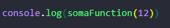

# Desafio Técnico 1 - Escribo

O desafio consiste em implementar uma função que receba um número positivo e retorne o somatório de todos os valores inteiros divisíveis por 3 ou 5 que sejam inferiores ao número passado.

### Instruções

1. Faça um **Fork** deste repositório;
2. **Clone** localmente: `https://github.com/SEUUSERNAME/desafio1-escribo.git`
3. Após fazer o clone, certifique que sua maquina tenha o node.js instalado para fazer a execução do arquivo.
4. Ao abrir o arquivo você vera a função "somaFunction" onde estará a logica do desafio.

5. Para manipular os valores de entrada da função, você deve inserir o numero desejado aonde está a mensagem "seunumeroaqui" (como na imagem anterior).

Exemplo de como deve ficar:

6. Apos inserir o valor desejado salve o arquivo, com o atalho "CTL + S" ou ir em File(Arquivo) e depois clicar em Save(Salvar).

7. Em seguida basta abrir seu terminal utilizando o atalho " CTL + " (aspas) " ou então atraves do botão Terminal e ir em new terminal (Novo terminal)

Imagem do terminal aberto: 

8. Com o seu terminal aberto escreva npm e o nome do arquivo em seguida da mesma maneira a seguir:

9. Após escreve o comando pressione ENTER e você verá o resultado: 

10. Se você conseguiu receber a mensagem "Voce obteve o numero... " quer dizer que conseguiu executar o programa corretamente. Caso queira testar com um novo numero basta modificar como no passo anterior e executar o comando novamente!
(OBS: Não esqueça de salvar o arquivo!)